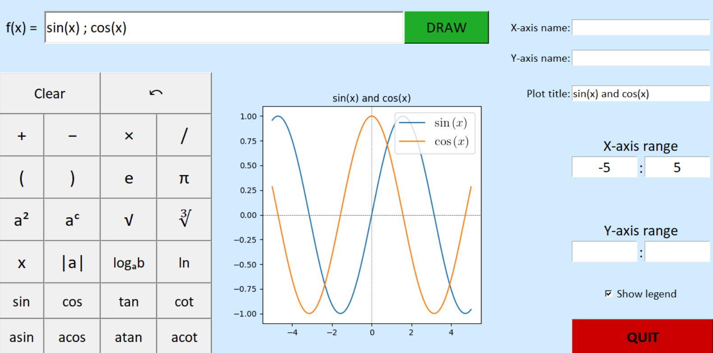

# Function Plotter
## Author: Szymon Malec

### Short description
A simple app designed for drawing plots. The program offers a grahical interface, which consists of keyboard for typing special functions, place to type functions formulas and a few customization options such as plot title or axis limits. It is possible to draw a few plots on one axis by typing functions formulas and separating them with ";". The program also displays errors when the user types incorrect values.

### Technologies
**Python** - a programming language in which the whole game is written.  
**Tkinter** - a python library designed for creating a graphical interface.  
**Matplotlib** - a python library designed for creating plots.
